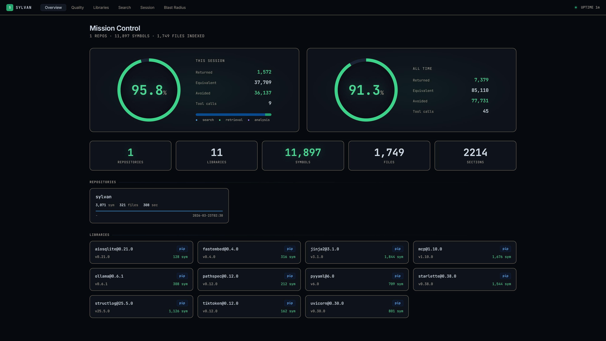
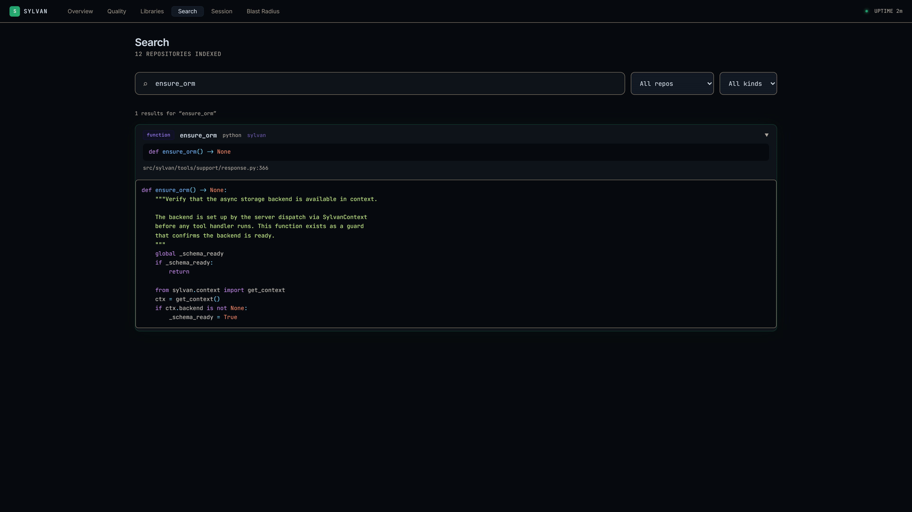
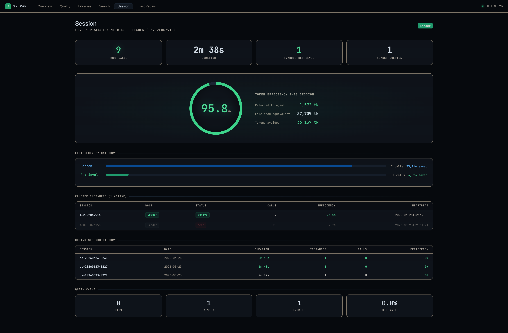
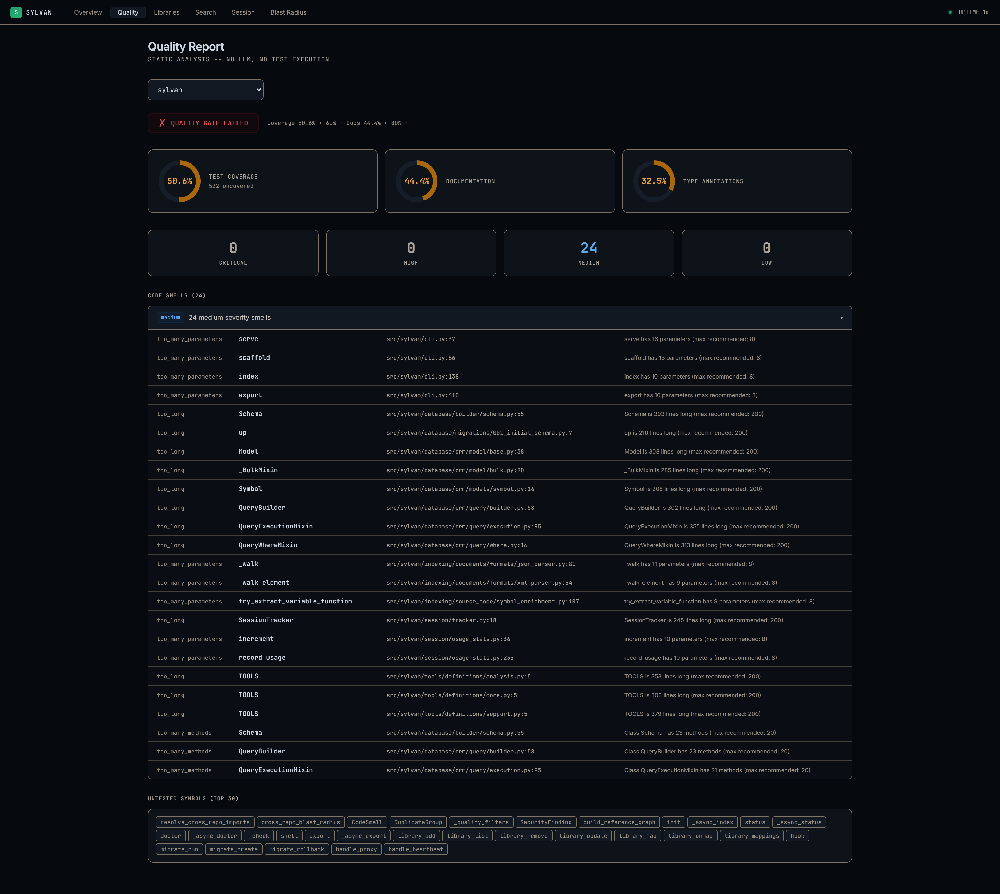
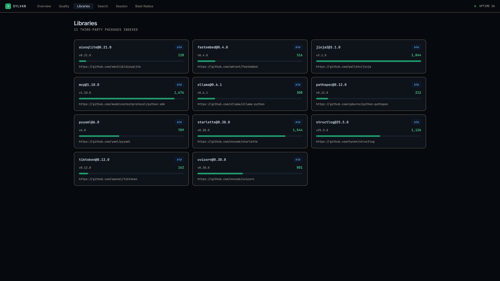

# Sylvan

Code intelligence platform for AI agents. Search, analyze, and navigate codebases through MCP tools — returning exactly the code your agent needs at a fraction of the token cost.

## Why

AI agents burn tokens reading entire files when they need one function. They grep across directories to trace a dependency. They piece together call chains one file at a time. Every wasted read costs money and context window space.

Sylvan indexes your codebase into a structured database of symbols, sections, and import relationships, then exposes it through 52 MCP tools. Your agent asks for what it needs and gets exactly that — function signatures, blast radius, dependency graphs, semantic search results. Typical token savings exceed 80%.

## Dashboard



<details>
<summary>More screenshots</summary>

**Search** — find code by name, signature, or keywords with syntax-highlighted source


**Session** — live token efficiency tracking per session and all-time


**Quality Report** — code smells, security findings, test/doc coverage


**Blast Radius** — visualize impact before changing a symbol


**Libraries** — indexed third-party packages with symbol counts


</details>

## Features

- 52 MCP tools for search, browsing, analysis, and refactoring
- 34 programming languages via tree-sitter
- Hybrid search — full-text (FTS5) + vector similarity with ranked fusion
- Blast radius analysis before any refactor
- Dependency graphs, call chains, class hierarchies
- Third-party library indexing (pip, npm, cargo, go)
- Multi-repo workspaces with cross-repo analysis
- Code quality reports — smells, security, duplication, dead code
- Web dashboard with live token efficiency tracking
- Multi-instance cluster support

## Quick start

```bash
pip install sylvan
```

Add to your MCP client config:

```json
{
  "mcpServers": {
    "sylvan": {
      "command": "uv",
      "args": ["run", "--directory", "/path/to/sylvan", "sylvan", "serve"]
    }
  }
}
```

Your agent handles the rest — index a project, search for code, navigate with precision.

## Documentation

Full docs at [darki73.github.io/sylvan](https://darki73.github.io/sylvan/)

## License

Non-commercial open source. Free to use, modify, and distribute with attribution. See [LICENSE](LICENSE) for details.
